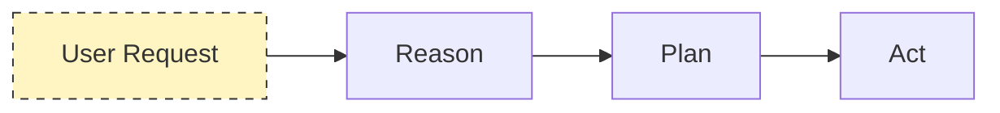
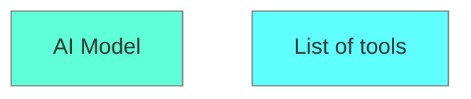
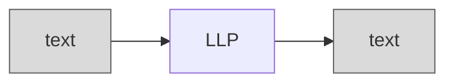

# Concepts

## Agent

Agent is: an **AI model capable of reasoning, planning, and interacting with its environment.**

User request: → REASON → PLAN → ACT (Agentt's List of known tools)

More formal way.

"An Agent is a system that leverages an **AI model** to **interact** with its **environment** in order to **achieve a user-defined objective**. 
It combines:
1. reasoning, 
2. planning, and 
3. the execution of actions (often via external tools) to fulfill tasks."

---

Agent process:

---

LLM - Takes Text as an input and outputs Text as well.

---

🔶 BRAIN → **AI model (LLM/BLM)**: 
decision process: which Actions to take based on the situation (reasoning & planning)

🔶 BODY  → **Capabilities and Tools**
Scope of **possible actions** depends on what the agent has been equipped with

> Note that Actions are not the same as Tools. 
> An Action, for instance, can involve the use of multiple Tools to complete.

An Agent is a system that uses an AI Model (typically an LLM) as its core reasoning engine, to:

* Understand natural language: Interpret and respond to human instructions in a meaningful way.
+ Reason and plan: Analyze information, make decisions, and devise strategies to solve problems.
* Interact with its environment: Gather information, take actions, and observe the results of those actions.

---

Quiz

Q1: Which of the following best describes an AI Agent?
> An AI model that can reason, plan, and use tools to interact with its environment to achieve a specific goal.

Q2: What is the Role of Planning in an Agent?
> To decide on the sequence of actions and select appropriate tools needed to fulfill the user’s request.

Q3: How Do Tools Enhance an Agent’s Capabilities?
> Tools provide the Agent with the ability to execute actions a text-generation model cannot perform natively, such as making coffee or generating images.

Q4: How Do Actions Differ from Tools?
> Actions are the steps the Agent takes, while Tools are external resources the Agent can use to perform those actions.

Q5: What Role Do Large Language Models (LLMs) Play in Agents?
> LLMs serve as the reasoning 'brain' of the Agent, processing text inputs to understand instructions and plan actions.

Q6: Which of the Following Best Demonstrates an AI Agent?
> A virtual assistant like Siri or Alexa that can understand spoken commands, reason through them, and perform tasks like setting reminders or sending messages.

## LLM

LLM  →  AI model that excels at **understanding and generating human language**

Most LLMs nowadays are built on the Transformer architecture—a deep learning architecture based on the “Attention” algorithm.

There are 3 types of transformers:

**1. Encoders**
An encoder-based Transformer takes text (or other data) as input and outputs a dense representation (or embedding) of that text.

* Example: BERT from Google
* Use Cases: Text classification, semantic search, Named Entity Recognition
* Typical Size: Millions of parameters

**2. Decoders**
A decoder-based Transformer focuses on generating new tokens to complete a sequence, one token at a time.

**3. Seq2seq**
A sequence-to-sequence Transformer combines an encoder and a decoder. The encoder first processes the input sequence into a context representation, then the decoder generates an output sequence.

The principle of an LLM is simple, yet effective:
**its objective is to predict the next token, given a sequence of previous tokens.**

* A “token” is the unit of information an LLM works with. 
* You can think of a “token” as if it was a “word”, but for efficiency reasons LLMs don’t use whole words.
* Each LLM has some special tokens specific to the model.
* The most important of those is the End of sequence token (EOS).

LLMs are autoregressive, meaning: **an LLM will decode text until it reaches the EOS**
* the output from one pass becomes the input for the next. 
* this cycle continues until the model predicts the next token to be the EOS token (which point the model can stop).

How It Works in Brief:
	1.	The input is tokenized and transformed into a contextual representation capturing meaning and position.
	2.	The model computes probabilities for the next token based on this context.
	3.	A decoding strategy (e.g., picking the highest probability) selects the next token.
	4.	This repeats until the model outputs EOS, signaling completion.

