# Agent workflow: 

Understanding AI Agents through the Thought-Action-Observation Cycle

> **I Agent Workflow, a cycle we defined as Thought-Action-Observation.**

<!---->

## The Core Components

> Agents work in a continuous cycle of: thinking (Thought) → acting (Act) and observing (Observe)

Let’s break down these actions together:

* **Thought**: Agent decides what the next step should be (LLM part of the agent).
* **Action**: The agent takes an action, by calling the tools with the associated arguments.
* **Observation**: The model reflects on the response from the tool.

> Generrally, the rules and guidelines are embedded directly into the system prompt, ensuring that every cycle adheres to a defined logic.


We see here that in the System Message we defined :

* The Agent’s behavior.
* The Tools our Agent has access to, as we described in the previous section.
* The Thought-Action-Observation Cycle, that we bake into the LLM instructions.

---

### Example:

Let’s take a small example to understand the process before going deeper into each step of the process:

```mermaid
sequenceDiagram
    participant User
    participant Alfred (agent)
    participant WeatherAPI (tool)

    User ->> Alfred (agent): What’s the weather in New York?

    Note right of Alfred (agent): Thought: I need to fetch weather data for New York.

    Alfred (agent) ->> WeatherAPI (tool): Call get_weather({"location": "New York"})

    WeatherAPI (tool) -->> Alfred (agent): "Partly cloudy, 15°C, 60% humidity"

    Note right of Alfred (agent): Observation: Weather data received.

    Note right of Alfred (agent): Updated Thought: I can now answer the user.

    Alfred (agent) ->> User: "The weather in New York is partly cloudy, 15°C, 60% humidity."
```

```mermaid
sequenceDiagram
    participant User
    participant Alfred_Thought as "Alfred (Thought)"
    participant Alfred_Action as "Alfred (Action)"
    participant Alfred_Observation as "Alfred (Observation)"
    participant WeatherAPI

    User ->> Alfred_Thought: What's the weather in New York?
    Note right of Alfred_Thought: "I need to fetch weather data for New York."

    Alfred_Thought ->> Alfred_Action: Prepare get_weather request for "New York"

    Alfred_Action ->> WeatherAPI: Call get_weather({"location": "New York"})
    WeatherAPI -->> Alfred_Observation: "Partly cloudy, 15°C, 60% humidity"

    Note right of Alfred_Observation: Received weather data.

    Alfred_Observation ->> Alfred_Thought: Provide observation feedback

    Note right of Alfred_Thought: "I can now answer the user."

    Alfred_Thought ->> User: "The weather in New York is partly cloudy, 15°C, 60% humidity."
```






---

What we see in this example:

**Agents iterate through a loop until the objective is fulfilled:**

Alfred’s process is cyclical. It starts with a thought, then acts by calling a tool, and finally observes the outcome. If the observation had indicated an error or incomplete data, Alfred could have re-entered the cycle to correct its approach.

**Tool Integration:**
The ability to call a tool (like a weather API) enables Alfred to go beyond static knowledge and retrieve real-time data, an essential aspect of many AI Agents.

**Dynamic Adaptation:**
Each cycle allows the agent to incorporate fresh information (observations) into its reasoning (thought), ensuring that the final answer is well-informed and accurate.


## ReAct

**ReAct cycle:** 
> the interplay (interaction) of `Thought`, `Action`, and Observation empowers AI agents to solve complex tasks iteratively


> By understanding and applying these principles, you can design agents that not only reason about their tasks but also effectively utilize external tools to complete them
>

### Thought: 

> Internal Reasoning and the ReAct Approach

✴️ **ReAct** approach
A prompting technique that encourages the model **to think <i>“step by step”</i> before acting**.
Let’s think step by step” before letting the LLM decode the next tokens, which in general leads to less errors than trying to generate the final solution directly.

A key method is the **ReAct** approach, which is the concatenation of “Reasoning” (`Think`) with “Acting” (`Act`).

🔶 We have recently seen a lot of interest for reasoning strategies. 
This is what's behind models like `Deepseek R1` or `OpenAI's o1`, which have been **fine-tuned** to **"think before answering"**.

### Action: 

> Enabling the Agent to Engage with Its Environment

#### Types of Agent Actions
There are multiple types of Agents that take actions differently:
•	**`JSON`Agent**: The Action to take is specified in JSON format.
•	**`Code` Agent**: The Agent writes a code block that is interpreted externally.
•	**`Function-calling` Agent**: It is a subcategory of the `JSON` Agent which has been fine-tuned to generate a new message for each action.


#### Actions purposes, examples:

* **Information Gathering**: queries, docs, web searches
* **Tool Usage**:  API call, executing code
* **Environment Interaction**: controlling: interfaces or physical devices.
* **Communication**: chat or collaborating with other agent

#### Json Agent

**The Stop and Parse Approach**

This method ensures that the agent’s output is structured and predictable:

* **Generation in a Structured Format**
The agent outputs its intended action in a clear, predetermined format (JSON or code).

* **(stopping) Halting Further Generation**
Once the text defining the action has been emitted, the LLM stops generating additional tokens. 
⚠️ This prevents extra or erroneous output.

* **Parsing the Output**
An external parser reads the formatted action, determines which Tool to call, and extracts the required parameters.

Example:

```json
Thought: I need to check the current weather for New York.
Action :
{
  "action": "get_weather",
  "action_input": {"location": "New York"}
}
```

* The framework can then easily parse the name of the function to call and the arguments to apply.
* This clear, machine-readable format minimizes errors and enables external tools to accurately process the agent’s command.

📝 **<u> Note: </u>** `Function-calling` agents operate similarly by structuring each action so that a designated function is invoked with the correct arguments.

### Code agent

**Instead of** outputting a simple `JSON object`, a `Code` Agent generates an **executable code block** — typically in a high-level language like Python.

Adavantages:

* **Expressiveness**: Code can naturally represent complex logic / flexibility
* **Modualrity and Reusability**: functions and modules that are reusable across different actions or tasks.
* **Enhanced Debuggability**: code errors are often easier to detect and correct.   
* **Direct Integration**: integrate directly with external libraries and APIs, enabling more complex operations.

This method also follows the `stop and parse approach` by clearly delimiting the code block and signaling when execution is complete.

Actions **<u>bridge</u>** (connect) an **agent’s internal reasoning** and **its real-world interactions** by executing clear, structured tasks — whether through `JSON`, `code`, or `function calls`.
