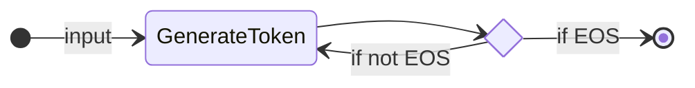
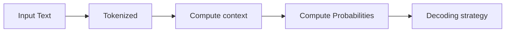

# LLM

LLM  →  AI model that excels at **understanding and generating human language**

Most LLMs nowadays are built on the Transformer architecture—a deep learning architecture based on the “Attention” algorithm.

---

## Transformes

There are 3 types of `transformers`:

**1. Encoders**
An encoder-based Transformer takes text (or other data) as input and outputs a dense representation (or embedding) of that text.

* Example: BERT from Google
* Use Cases: Text classification, semantic search, Named Entity Recognition
* Typical Size: Millions of parameters

**2. Decoders**
A decoder-based Transformer focuses on generating new tokens to complete a sequence, one token at a time.

**3. Seq2seq**
A sequence-to-sequence Transformer combines an encoder and a decoder. The encoder first processes the input sequence into a context representation, then the decoder generates an output sequence.

---
## What a LLM does?

> The principle of an LLM is simple, yet effective:
> **its objective is to predict the next token, given a sequence of previous tokens.**

* **A “token” is the unit of information an LLM works with.** 
  * You can think of a “token” as if it was a “word”, but for efficiency reasons LLMs don't use whole words.
  * For example, while English has an estimated 600,000 words, an LLM might have a vocabulary of around 32,000 tokens (as is the case with Llama 2). 
* **Tokenization often works on sub-word units that can be combined.**
  * For instance, consider how the tokens “interest” and “ing” can be combined to form “interesting”, or “ed” can be appended to form “interested.”
* **Each LLM has some special tokens specific to the model.**
  * for example, an End of sequence token (`EOS`) [the most important].
  * the forms of special tokens are highly diverse across model providers.
 
---

### Understanding next token prediction

LLMs are autoregressive, meaning: **an LLM will decode text until it reaches the `EOS`**
* the output from one pass becomes the input for the next. 
* this cycle continues until the model predicts the next token to be the EOS token.



### But what happens during a single decoding loop?

How It Works in Brief:
	1.	The input is tokenized and transformed into a contextual representation capturing meaning and position.
	2.	The model computes probabilities for the next token based on this context.
	3.	A decoding strategy (e.g., picking the highest probability) selects the next token.
	4.	This repeats until the model outputs EOS, signaling completion.



### Decoding strategy

* **Greedy decoding**: Always pick the token with the highest probability.
* **Beam search**: Explore multiple candidate sequences and pick the one with the highest total score.
* **Sampling**: Randomly sample tokens from the probability distribution.
* **Top-k sampling**: Randomly sample tokens from the top-k most likely tokens.

___

## Attention is all you need

> 🧠 This process of **identifying the most relevant words** to **predict the next token** has proven to be **incredibly effective**.


A key aspect of the Transformer architecture is Attention. When predicting the next word, not every word in a sentence is equally important; 

* For example: words like “France” and “capital” in the sentence “The capital of France is …” carry the most meaning.


Although the basic principle of LLMs—predicting the next token—has remained consistent since GPT-2, there have been significant advancements in scaling neural networks and making the attention mechanism work for longer and longer sequences.

> If you’ve interacted with LLMs, you’re probably familiar with the term `context length`, which refers to the maximum number of tokens the LLM can process, and the maximum attention span it has.

---

### Prompting the LLM is important

Considering that the only job of an LLM is to predict the next token by looking at every input token, and to choose which tokens are “important”, the wording of your input sequence is very important.

The input sequence you provide an LLM is called a prompt.

Careful design of the prompt makes it easier to guide the generation of the LLM toward the desired output.

---

### How are LLMs trained?

LLMs are trained on large datasets of text, where they learn to predict the next word in a sequence through a self-supervised or masked language modeling objective.

From this unsupervised learning, the model learns the structure of the language and underlying patterns in text, allowing the model to generalize to unseen data.

After this **initial pre-training**, LLMs can be **fine-tuned** on a supervised learning objective **to perform specific tasks**. 

For example, some models are trained for :
* **conversational** structures or **tool usage**, 
* while others focus on **classification** or **code generation**.

---

### How are LLMs used in AI Agents?

> 🧠 LM is the brain of the Agent.

LLMs are a key component of AI Agents, providing the foundation for understanding and generating human language.

They can interpret user instructions, maintain context in conversations, define a plan and decide which tools to use.

---

## Chat Templates

## Chat Templates

source: [HF:messages-and-special-tokens](https://huggingface.co/learn/agents-course/unit1/messages-and-special-tokens)

Each LLM uses a specific prompt formatting to format messages into a format that it understands.

* Just as each LLM uses its own `EOS` (End of Sequence) token,

* they also use different formatting rules and delimiters for messages in the conversation.

**Chat templates** act as the **bridge** between the `messages` (the user and assistant turns) and the `formatting requirements` specific to the chosen LLM.

Behind the scenes, these messages are concatenated and formatted into a prompt that the template can understand.

💬 **`Chat templates`** structure the **communication** (message exchanges) between the **user** and the **agent**.

---

### Message Types

* **`System`**: define how the model should behave 
  * they serve as persistent instructions, guiding each subsequent interaction
* **`User`**: user instruction messages
* **`Assistant`**: agent response messages

A **conversation** consists of **alternating messages** between a **Human** (`user`) and an **LLM** (`assistant`).

`chat_templates` help maintain context by preserving the conversation history between the `user` and the `assistant`.
> This results in more coherent, multi-turn conversations.

When using **Agents**, the **System Message** can also provide:

* information about the **tools** available,

* instructions to the model on **how to format the actions** to be taken, and

* includes **guidelines** on how the **thought process** should be segmented

---
### Base Models vs. Instruction Models

Another point we need to understand is the difference between a `Base Model` and an `Instruction Model`:

• A `Base Model` is trained on raw text data to predict the next token.

• An `Instruction Model` is **fine-tuned** specifically for following instructions and participating in conversations.

For example, `SmolLM2-135M` is a `base model`, while `SmolLM2-135M-Instruct` is its variant **fine-tuned** for instructions.

---

### Understanding Chat Models

Since each **statement model** uses different `conversational formats` and `special tokens`, **chat models** are implemented to ensure that we format the prompt correctly, as expected by each model.

In **transformers**, `chat models` include `Jinja2` code that describes how to transform the **ChatML JSON message list** so that the model can understand it.

This structure helps maintain consistency between interactions and ensures that the model responds appropriately to different types of input.

### Messages to Template

The easiest way to ensure your LLM receives a conversation correctly formatted is to use the `chat_template` from the `model’s tokenizer`.

```python
messages = [
    {"role": "system", "content": "You are an AI assistant with access to various tools."},
    {"role": "user", "content": "Hi !"},
    {"role": "assistant", "content": "Hi human, what can help you with ?"},
]
```

To convert the previous conversation into a prompt, we load the tokenizer and call apply_chat_template:

```python
from transformers import AutoTokenizer

tokenizer = AutoTokenizer.from_pretrained("HuggingFaceTB/SmolLM2-1.7B-Instruct")
rendered_prompt = tokenizer.apply_chat_template(messages, tokenize=False, add_generation_prompt=True)      
```

The rendered_prompt returned by this function is now ready to use as the input for the model you chose!
