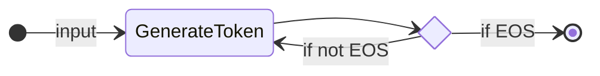
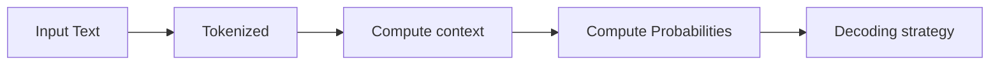

# LLM

Um LLM é um tipo de modelo de IA que se **destaca na compreensão e geração de linguagem humana**. 

A maioria dos LLMs atuais é construída na arquitetura `Transformer` — uma arquitetura de ***deep learning*** baseada no algoritmo `Attention`, que ganhou interesse significativo desde o lançamento do BERT pelo Google em 2018.

---

## Transformes

Existem 3 tipos de `transformers`:

**1. Encoders**
Um `encoder-based transformer` recebe texto (ou outros dados) como entrada e gera uma representação densa (ou embedding/incorporação) desse texto.
* Exemplo: BERT do Google
* Casos de Uso: Classificação de texto, busca semântica, Reconhecimento de Entidades Nomeadas
* Tamanho Típico: Milhões de parâmetros

**2. Decoders**
Um `decoder-based transformer` concentra-se na geração de novos tokens para completar uma sequência, um token por vez.

* Exemplo: Llama do Meta
* Casos de Uso: Geração de texto, chatbots, geração de código
* Tamanho Típico: Bilhões (no sentido americano, ou seja, 10^9) de parâmetros

**3. Seq2seq**
Um `sequence-to-sequence transformer` combina um ENCODER e um DECODER. 
O codificador primeiro processa a sequência de entrada em uma representação de contexto e, em seguida, o decodificador gera uma sequência de saída.

* Exemplo: T5, BART
* Casos de Uso: Tradução, Resumo, Paráfrase
* Tamanho Típico: Milhões de parâmetros

---

## O que um LLM faz?

> O princípio subjacente de um LLM é simples, mas altamente eficaz: 
> seu objetivo é **prever o próximo `token`**, dada uma sequência de `tokens` anteriores. 

* **Um `token` é a unidade de informação com a qual um LLM trabalha.**
  * Você pode pensar em um `token` como se fosse uma "palavra", mas, por razões de eficiência, os LLMs não usam palavras inteiras.
  * Por exemplo, enquanto o inglês tem cerca de 600.000 palavras, um LLM pode ter um vocabulário de cerca de 32.000 `tokens` (como é o caso do Llama 2). 
* **A tokenização geralmente funciona em unidades de `subpalavras` que podem ser combinadas.**
  * Por exemplo, considere como os **tokens** `"interest"` e `"ing"` podem ser combinados para formar `"interesting"`, ou como `"ed"` pode ser adicionado para formar `"interested"`.
* **Cada LLM tem alguns tokens especiais**
  * Por exemplo, um token de fim de sequência (EOS) [considerado o mais importante].
  * Os formatos de tokens especiais são bastante diversos entre os provedores de modelos.

---

### Compreendendo a previsão do próximo token

Os LLMs são considerados autorregressivos, o que significa: 
* que a saída de uma passagem se torna a entrada para a próxima. 
* esse loop continua até que o modelo alcance o token `EOS`. 
  


### Mas o que acontece durante um loop de decodificação?

Uma breve visão geral:

* O texto de entrada é tokenizado, 
* O modelo **calcula uma representação da sequência**, o que captura informações sobre o significado e a posição de cada **token** na **sequência de entrada**.
* É calculado a probabilidade de cada token ser o próximo na sequência. 
* Com base nessas pontuações, temos diversas estratégias para selecionar os tokens que completam a frase.
  * A estratégia de decodificação mais fácil seria sempre escolher o token com a pontuação mais alta.
* Isso se repete até o modelo gerar o token `EOS`.




---

### Decoding strategy

* **Greedy decoding**: Sempre escolha o token com a maior probabilidade.
* **Beam search**: Explora várias sequências candidatas e escolha aquela com a maior pontuação total.
* **Sampling**: Amostragem aleatória de tokens da distribuição de probabilidade.
* **Top-k sampling**: Amostragem aleatória de tokens entre os k tokens mais prováveis.

--- 

### Attention is all you need

> 🧠 Este processo de **identificar as palavras mais relevantes** para **prever o próximo token** provou ser **incrivelmente eficaz**.

Um aspecto fundamental da arquitetura do Transformer é a Atenção. Ao prever a próxima palavra, nem todas as palavras em uma frase são igualmente importantes; 

* Por exemplo: palavras como "França" e "capital" na frase "A capital da França é..." são as que carregam mais significado.

Embora o princípio básico dos LLMs — prever o próximo token — tenha permanecido consistente desde o GPT-2, **houve avanços significativos no escalonamento de redes neurais e no funcionamento do mecanismo de atenção por sequências cada vez mais longas.**

Se você já interagiu com LLMs, provavelmente está familiarizado com o termo comprimento de contexto (`context length`), que se refere ao número máximo de tokens que o LLM pode processar e ao seu período máximo de atenção.

---

### Prompting o LLM é importante

Considerando que a única função de um LLM é prever o **próximo token** analisando cada token de entrada e escolher quais tokens são "importantes", a **formulação da sua sequência de entrada é muito importante**.

> **prompt** é a sequência de entrada que você fornece a um LLM.

O **design do prompt** facilita o <u>trabalho do LLM</u> de gerar **saída desejada**.


### Como os LLMs são treinados?

Os LLMs são treinados em grandes conjuntos de dados de texto, onde aprendem a prever a próxima palavra em uma sequência por meio de um objetivo de modelagem de linguagem autossupervisionado ou mascarado.

A partir desse aprendizado não supervisionado, o modelo aprende a estrutura da linguagem e os padrões subjacentes no texto, permitindo que o modelo generalize para dados invisíveis.

Após esse **pré-treinamento** inicial, os LLMs podem ser **ajustados** com base em um objetivo de aprendizado supervisionado **para executar tarefas específicas**. 

* Por exemplo, alguns modelos são treinados para
  * estruturas **conversacionais** ou **uso de ferramentas**, 
  * enquanto outros se concentram em **classificação** ou **geração de código**.

---

### Como os LLMs são usados em Agentes de IA?

> 🧠 LLM é o cérebro do Agente.

Os `LLMs` são um **componente essencial** dos `Agentes de IA`, fornecendo a b**ase para a compreensão e geração da linguagem humana**.

os `LLMs` podem interpretar instruções do usuário, manter o contexto em conversas, definir um plano e decidir quais ferramentas usar.

---

## Chat Templates (modelos de chat)

source: [HF:messages-and-special-tokens](https://huggingface.co/learn/agents-course/unit1/messages-and-special-tokens)


Cada LLM usa uma formatação específica de prompt para formatar as mensagens num formato que ele entenda.

* Assim como cada LLM usa seu próprio token `EOS` (Fim de Sequência), 
* eles também usam regras de formatação e delimitadores diferentes para as mensagens na conversa.

Os **`modelos de chat`** atuam como a **ponte** entre as `mensagens` (os turnos do usuário e do assistente) e os `requisitos de formatação` específicos do LLM escolhido. 
Nos bastidores, essas mensagens são concatenadas e formatadas em um prompt que o modelo pode entender.

💬 Os **`modelos de chat`** estruturam a **comunicação** (trocas de mensagens) entre o **usuário** e o **agente**.

---

### Tipos de Mensagens

* **`System`**: definem como o modelo deve se comportar, 
  * elas servem como instruções persistentes, guiando cada interação subsequente.
* **`User`**: mensagens de instrução do usuário
* **`Assistant`**: mensagens de resposta do agente
  
Uma **conversa** consiste em **mensagens alternadas** entre um **Humano** (`user`) e um **LLM** (`assistant`).

Os `chat_templates` ajudam a manter o contexto, preservando o histórico de conversas entre o `usuário` e o `assistente`. 
> Isso resulta em conversas mais coerentes e em múltiplos turnos.

Ao usar **Agentes**, a **Mensagem do Sistema** também pode fornecer:

* informações sobre as **ferramentas** disponíveis, 
* instruções ao modelo sobre **como formatar as ações** a serem tomadas e
* inclui **diretrizes** sobre como o **processo de pensamento** deve ser segmentado

---

### Modelos Base vs. Modelos de Instrução

Outro ponto que precisamos entender é a diferença entre um `Modelo Base` e um `Modelo de Instrução`:

•	Um `Modelo Base` é treinado com dados de texto brutos para prever o próximo token.

•	Um `Modelo de Instrução` é **fine-tuned** (ajustado) especificamente para seguir instruções e participar de conversas. 

Por exemplo, `SmolLM2-135M` é um `modelo base`, enquanto `SmolLM2-135M-Instruct` é sua variante **fine-tuned** para instruções.

---

### Compreendendo os Modelos de Chat

Como cada **modelo de instrução** utiliza diferentes `formatos de conversação` e `tokens especiais`, os **modelos de chat** são implementados para garantir que formatemos o prompt corretamente, conforme esperado por cada modelo.

Em **transformers**, os `modelos de chat` incluem código `Jinja2` que descreve como transformar a **lista de mensagens JSON do ChatML**, para que o modelo possa entender.

Essa estrutura ajuda a manter a consistência entre as interações e garante que o modelo responda adequadamente a diferentes tipos de entradas.

---

### Mensagens para Prompts

A maneira mais fácil de garantir que seu LLM receba uma conversa formatada corretamente é usar o `chat_template` do `tokenizador` do modelo.

```python
messages = [
    {"role": "system", "content": "You are an AI assistant with access to various tools."},
    {"role": "user", "content": "Hi !"},
    {"role": "assistant", "content": "Hi human, what can help you with ?"},
]
```

Para converter a conversa anterior em um `prompt`, carregue o `tokenizador` e chame `apply_chat_template`:

```python
from transformers import AutoTokenizer

tokenizer = AutoTokenizer.from_pretrained("HuggingFaceTB/SmolLM2-1.7B-Instruct")
rendered_prompt = tokenizer.apply_chat_template(messages, tokenize=False, add_generation_prompt=True)      
```
O `rendered_prompt` retornado por esta função agora está pronto para ser usado como entrada para o modelo que você escolheu!

Esta função `apply_chat_template()` será usada no backend da sua API quando você interagir com mensagens no formato `ChatML`.

Agora que vimos como os LLMs estruturam suas entradas por meio de `modelos de chat`, vamos explorar como os `Agentes` agem em seus ambientes.

Uma das principais maneiras de fazer isso é usando `Ferramentas`, que __**estendem os recursos**__ de um modelo de IA para além da geração de texto.

