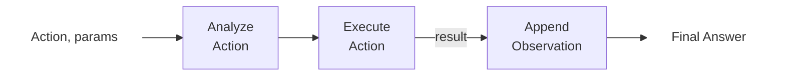

# Agentes `agents`
***`Thought`-`Action`-`Observation`.***

Um agente é um sistema que pode 'pensar', planificar e interagir com seu ambiente. Em outras palavras, um agente é definido por ciclos  **`Pensar`-`Agir`-`Observar`** 


* **Pensamento**: A parte `LLM` do `agente` **decide** qual deve ser o **próximo passo**.
* **Ação**: O `agente` realiza uma **ação**, chamando as ferramentas com os argumentos associados.
* **Observação**: O `LLM` **reflete** sobre a resposta da ferramenta.

Os três componentes trabalham juntos em um **loop contínuo** até que o **objetivo do agente seja alcançado** ou um "erro" seja detectado (ex: falha na comunicação).


> 👉 Geralmente, as **regras e diretrizes** são incorporadas diretamente no **prompt do sistema** (`system: ""`), garantindo que cada ciclo obedeça a uma lógica definida.


No **prompt do sistema** (`system: ""`), podemos definir:

* O comportamento do `Agente`.
* As `Ferramentas` às quais nosso Agente tem acesso, conforme descrito na seção anterior.
* O `Ciclo Pensamento-Ação-Observação`, que incorporamos às instruções do LLM.

```python
SYSTEM_PROMPT = """Answer the following questions as best you can. 
You have access to the following tools:

get_weather: Get the current weather in a given location

The way you use the tools is by specifying a json blob.
Specifically, this json should have a `action` key (with the name of the tool to use) and a `action_input` key (with the input to the tool going here).

The only values that should be in the "action" field are:
get_weather: Get the current weather in a given location, args: {{"location": {{"type": "string"}}}}
example use :

'''
{{
  "action": "get_weather",
  "action_input": {"location": "New York"}
}}

ALWAYS use the following format:

QUESTION: the input question you must answer
THOUGHT: you should always think about one action to take. Only one action at a time in this format:
Action:
'''

$JSON_BLOB

OBSERVATION: the result of the action. This Observation is unique, complete, and the source of truth.
... (this Thought/Action/Observation can repeat N times, you should take several steps when needed. The $JSON_BLOB must be formatted as markdown and only use a SINGLE action at a time.)

You must always end your output with the following format:

THOUGHT: I now know the final answer

FINAL ANSWER: the final answer to the original input question

Now begin! Reminder to ALWAYS use the exact characters `FINAL ANSWERr:` when you provide a definitive answer. 
"""
```

### Example:

Let’s take a small example to understand the process before going deeper into each step of the process:


***REVIEW THE MERMAID FLOW - PROCESS***

```mermaid
```


**Integração de Ferramentas**
A capacidade de chamar uma ferramenta (como uma API de previsão do tempo) permite que o `agente` Alfred vá além do conhecimento e recupere **dados em tempo real**, um aspecto essencial de muitos Agentes de IA.


**Adaptação Dinâmica**
Cada ciclo permite que o `agente` incorpore novas informações (`observações`) ao seu raciocínio (`pensamento`), garantindo que a resposta final seja bem informada e precisa.

> Este exemplo demonstra o conceito central por trás do ciclo ReAct: 
> A*interação entre `Pensamento`, `Ação` e `Observação` **capacita os agentes de IA** a resolver tarefas complexas iterativamente.

## ReAct

A abordagem **`ReAct`**, uma técnica de prompting que incentiva o modelo a pensar "passo a passo" antes de **`agir`** e antes de permitir que o **`LLM`** decodifique os próximos tokens para resposta final.

Quando um `LLM` é guiado a pensar "passo a passo", envorajando um processo de decodificação em direção aos próximos tokens que geram um plano, em vez de uma solução final, já que o `LLM` é incentivado a decompor o problema em subtarefas antes.

> **🔄 Ciclo ReAct**
> A intereção entre **`Thought`**, **`Action`**, and **`Observation`** capacita os agentes de IA a resolver tarefas complexas de forma iterativa

```mermaid
flowchart LR
    A[User]:::noteStyle
    B[Thought]
    C[Action]
    D[Observation]
    E[User]:::noteStyle

    A--> B --> C --> D --> E
    D --> B

    classDef noteStyle fill:#fff5c2,stroke:#333,stroke-dasharray: 5 5;
```

🔶 Temos visto **recentemente um grande interesse por <u>estratégias de raciocínio</u>**. É isso que está por trás de modelos como o `Deepseek R1` ou o `o1` da OpenAI, que foram **fine-tuned** (aprimorados) para **"pensar antes de responder"**.

Esses modelos foram treinados para sempre incluir **`seções de pensamento`** específicas, entre os tokens especiais **`<think>`** ... **`</think>`**. 

Esta **não é apenas uma técnica de prompt como o ReAct**, **mas um método de treinamento em que o modelo aprende a gerar essas seções** após analisar milhares de exemplos que mostram o que esperamos que ele faça.

---

### Pensamento (`Thought`)

> 🧠 **Raciocínio Interno do Agente**

Os pensamentos representam o raciocínio interno e os processos de planejamento do agente para resolver a tarefa. 

O **`agente`** utiliza a capacidade do **`LLM`** de analisar informações disponíveis e cria estratégias para atingir seus objetivos. Pense nisso como o diálogo interno do agente, onde ele considera a tarefa em questão e elabora estratégias para sua abordagem. Por meio desse processo, o **`agente`** pode **decompor problemas complexos em etapas menores e mais gerenciáveis**, refletir sobre experiências passadas e ajustar continuamente seus planos com base em novas informações.

**Tipos de Pensamento (exemplos):**

| Tipo | Descrição |
| --- | --- |
| **Planejamento** | “Preciso dividir esta tarefa em três etapas: 1. coletar dados, 2. analisar tendências, 3. gerar relatório” |
| **Análise**  | “Com base na mensagem de erro, o problema parece estar nos parâmetros de conexão com o banco de dados” |
| **Tomada de Decisão** | “Dadas as restrições orçamentárias do usuário, devo recomendar a opção intermediária” |
| **Resolução de Problemas** | “Para otimizar este código, devo primeiro criá-lo para identificar gargalos” |
| **Integração de Memória** | “O usuário mencionou sua preferência por Python anteriormente, então fornecerei exemplos em Python” |
| **Autorreflexão** | “Minha última abordagem não funcionou bem, devo tentar uma estratégia diferente” |
| **Definição de Metas** |“Para concluir esta tarefa, preciso primeiro estabelecer os critérios de aceitação” |
| **Priorização** | “A vulnerabilidade de segurança deve ser corrigida antes da adição de novos recursos” |

### Ação (`Action`)

> ▶️ **Como o agente interage com seu ambiente**
> * As `ações` representam as decisões e `ações` tomadas pelo `agente` para atingir um objetivo.

> ▶️ As Ações <u>*conectam*</u> o **raciocínio interno** de um **`agente`** e suas i**nterações no mundo real**, permitindo que ele execute tarefas de froma clara e estruturada.


#### Tipos de ações do `agente`

* **`JSON`Agent**: a ação a ser executada é especificada no formato JSON.
* **`Code` Agent**: o Agente escreve um bloco de código que é interpretado externamente.
* **`Function-calling` Agent**: é uma subcategoria do Agente JSON que foi ajustada para gerar uma nova mensagem para cada ação.

#### Ações em podem servir a muitos propósitos:

* **Coleta de Informações**: realizar pesquisas na web, consultar bancos de dados ou recuperar documentos.
* **Uso de Ferramentas**: fazer chamadas de API, executar cálculos e executar código.
* **Interação com o Ambiente**: manipular interfaces digitais ou controlar dispositivos físicos.
* **Comunicação**: interagir com usuários por chat ou colaborar com outros agentes.
* **Servidores MCP**: conectar-se com ferramentas externas, fontes de dados e aplicativos.
* **Acesso à Memória**: armazenar e recuperar informações da memória (sistemas RAG).

#### A Abordagem de Parar e Analisar

> * Uma `ação` para o `LLM` é um texto que **descreve uma ação** e os seus **parametros de entrada** (opcionalmente de **parametros de saída**). 
> * Isso serve como uma orientação para guiar o `agente` a como utilizar uma determinada ferramenta para realizar a ação desejada. 

Um método fundamental para implementar ações é a abordagem de parar e analisar. 

Para que um **`agente`** funcione corretamente, o **`agente`** precisa interceptar a resposta do `LLM`, esperando que o **`LLM`** **🛑 pare** de gerar novos tokens após emitir todos os tokens para definir uma Ação completa. 

Este método garante que a saída do agente seja estruturada e previsível:

**1. Gera um Formato Estruturado**
O agente emite a ação pretendida em um formato claro e predeterminado 
 * Formatos: `JSON`, `Code`, `Function-calling`.

**2. Interrompe a Geração Adicional**
Após a emissão do texto que define a **`ação`**, o **`LLM`** interrompe a geração de tokens adicionais. 

* 🚥 Isso evita saídas extras ou errôneas.

**3. Analisa a Saída**
A `ação formatada` é lida e é determinada qual **`ferramenta`** deve ser usada e quais são **`parâmetros`** necessários para executar a ação.
* O controle volta para o **`agente`**, que precisa **parar e analisar** a resposta, para garantir que o resultado seja analisável no formato pretendido, e que a ação possa executada corretamente.


Por exemplo, um agente que precisa verificar a previsão do tempo poderia ser gerado a seguinte ação:

```python
Thought: I need to check the current weather for New York.
Action :
{
  "action": "get_weather",
  "action_input": {"location": "New York"}
}
```

Desta forma, o nome da função e os seus argumentos podem ser chamados facilemente. Este formato é claro e minimiza o risco de erros. Isso permite que ferramentas externas possam executar a ação com precisão.

#### Agentes de código

Em vez de gerar um objeto JSON, um **`Agentes de código`** gera um `bloco de código` executável — normalmente em uma linguagem de alto nível como Python.

Essa abordagem oferece diversas vantagens:

* Expressividade: O código pode representar lógica complexa naturalmente, incluindo loops, condicionais e funções aninhadas, proporcionando maior flexibilidade do que JSON.
* Modularidade e Reutilização: O código gerado pode incluir funções e módulos reutilizáveis em diferentes ações ou tarefas.
* Depuração Aprimorada: Com uma sintaxe de programação bem definida, erros de código costumam ser mais fáceis de detectar e corrigir.
* Integração Direta: Os Agentes de Código podem se integrar diretamente com bibliotecas e APIs externas, permitindo operações mais complexas, como processamento de dados ou tomada de decisões em tempo real.

```python
# Code Agent Example: Retrieve Weather Information
def get_weather(city):
    import requests
    api_url = f"https://api.weather.com/v1/location/{city}?apiKey=YOUR_API_KEY"
    response = requests.get(api_url)
    if response.status_code == 200:
        data = response.json()
        return data.get("weather", "No weather information available")
    else:
        return "Error: Unable to fetch weather data."

# Execute the function and prepare the final answer
result = get_weather("New York")
final_answer = f"The current weather in New York is: {result}"
print(final_answer)
```

Neste exemplo, o `Agente de Código`:

•	Recupera dados meteorológicos por meio de uma chamada de API,
•	Processa a resposta,
•	E usa a função print() para gerar uma resposta final.


---

### Observação (`Observation`)

> 🧐 ** como um Agente percebe os resultados de suas ações**

As observações representam os resultados das ações e os dados coletados ao longo do processo.

Na fase de observação, oa agente:

* **Coleta Feedback** 
  Recebe dados ou confirmação de que sua ação foi bem-sucedida (ou não).
* **Anexa Resultado** 
  Integra as novas informações ao seu contexto existente, atualizando a sua memória.
* **Adapta sua Estratégia** 
  Usa esse contexto atualizado para refinar pensamentos e ações subsequentes.
* **Avalia o Resultado**
  Decide se necessita de informações adicionais ou se está pronto para retornar a resposta final. 

Essa incorporação iterativa do feedback garante que o **`agente`** **permaneça dinamicamente alinhado com seus objetivos, aprendendo e se ajustando constantemente** com base em resultados reais.

#### Tipos de Observação:

* **Feedback do Sistema**: Mensagens de erro, notificações de sucesso, códigos de status
* **Alterações de Dados**: Atualizações de banco de dados, modificações no sistema de arquivos, alterações de estado
* **Ambientais**: Leituras do Sensor de Dados, métricas do sistema, uso de recursos
* **Análise de Resposta**: Respostas da API, resultados de consultas, saídas de computação
* **Baseado em Tempo**: Prazos de Eventos atingidos, tarefas agendadas concluídas

#### Como os Resultados São Anexados?

Após executar uma ação, o framework segue estas etapas em ordem:

* Analisar a ação para identificar a(s) função(ões) a ser(em) chamada(s) e o(s) argumento(s) a ser(em) usado(s).
* Executar a ação.
* Anexar o resultado como uma Observação.




### Combinando Pensamento, Ação e Observação

Example:

`Thought` → `Action` → `Observation`
```python

Thought: I will check the weather in London.
Action:
'''
{
  "action": "get_weather",
  "action_input": {"location": "London"}
}
'''

Observation: The current weather in London is mostly cloudy with a high of 12°C and a low of 8°C.

```