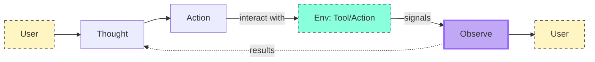

# Agent workflow: 

> **Agent Workflow, a cycle we defined as Thought-Action-Observation.**

<!---->

## The Core Components

> Agents work in a continuous cycle of: thinking (Thought) → acting (Act) and observing (Observe)

Let’s break down these actions together:

* **Thought**: Agent decides what the next step should be (LLM part of the agent).
* **Action**: The agent takes an action, by calling the tools with the associated arguments.
* **Observation**: The model reflects on the response from the tool.

> Generrally, the rules and guidelines are embedded directly into the system prompt, ensuring that every cycle adheres to a defined logic.


In the System Message we can define the following:

* The Agent’s behavior.
* The Tools our Agent has access to, as we described in the previous section.
* The Thought-Action-Observation Cycle, that we bake into the LLM instructions.

```python
```

---

### Example:

Let’s take a small example to understand the process before going deeper into each step of the process:

***REVIEW THE MERMAID FLOW - PROCESS***

```mermaid
```

---

What we see in this example:

**Agents iterate through a loop until the objective is fulfilled:**

Alfred’s process is cyclical. It starts with a thought, then acts by calling a tool, and finally observes the outcome. If the observation had indicated an error or incomplete data, Alfred could have re-entered the cycle to correct its approach.

**Tool Integration:**
The ability to call a tool (like a weather API) enables Alfred to go beyond static knowledge and retrieve real-time data, an essential aspect of many AI Agents.

**Dynamic Adaptation:**
Each cycle allows the agent to incorporate fresh information (observations) into its reasoning (thought), ensuring that the final answer is well-informed and accurate.


## ReAct

The **`ReAct`** approach, a prompting technique that encourages the model to think "step by step" before **`acting`** and before allowing **`LLM`** to decode the next tokens for the final answer.

When LLM is guided to think "step by step", encouraging a decoding process towards the next tokens that generate a **plan**, rather than a **final solution**, since the `LLM` is encouraged to decompose the problem into subtasks before.

> 🔄 **ReAct cycle:** 
> the interplay (interaction) of `Thought`, `Action`, and `Observation` empowers AI agents to solve complex tasks iteratively

```mermaid
flowchart LR
    A[User]:::noteStyle
    B[Thought]
    C[Action]
    D[Observation]
    E[User]:::noteStyle

    A--> B --> C --> D --> E
    D --> B

    classDef noteStyle fill:#fff5c2,stroke:#333,stroke-dasharray: 5 5;
```

🔶 We have recently seen a lot of interest for reasoning strategies. 
This is what's behind models like `Deepseek R1` or `OpenAI's o1`, which have been **fine-tuned** to **"think before answering"**.

These models have been trained to always include specific `thought chunks`, enclosed in special tokens like **`<think>`** ... **`<\think>`**.

This is not just a prompting technique like ReAct, **but a training method where the model learns to generate these chunks** after analyzing thousands of examples that show what we expect it to do.


### Thought: 

> 🧠 **Internal Reasoning of the Agent**

**Type of Thought	(examples):**

| Type | Desc |
|---|---|
| **Planning**	| “I need to break this task into three steps: 1) gather data, 2) analyze trends, 3) generate report” | |
| **Analysis** | “Based on the error message, the issue appears to be with the database connection parameters” |
| **Decision Making** | “Given the user’s budget constraints, I should recommend the mid-tier option” |
| **Problem Solving** | “To optimize this code, I should first profile it to identify bottlenecks” |
| **Memory Integration** | “The user mentioned their preference for Python earlier, so I’ll provide examples in Python” |
| **Self-Reflection** | “My last approach didn’t work well, I should try a different strategy” |
| **Goal Setting** | “To complete this task, I need to first establish the acceptance criteria” |
| **Prioritization** | “The security vulnerability should be addressed before adding new features” |


### Action: 

> ▶️ **How the Agent to Engage (interact) with Its Environment**

#### Types of Agent Actions
There are multiple types of Agents that take actions differently:
•	**`JSON`Agent**: The Action to take is specified in JSON format.
•	**`Code` Agent**: The Agent writes a code block that is interpreted externally.
•	**`Function-calling` Agent**: It is a subcategory of the `JSON` Agent which has been fine-tuned to generate a new message for each action.


#### Actions purposes, examples:

* **Information Gathering**: queries, docs, web searches
* **Tool Usage**:  API call, executing code
* **Environment Interaction**: controlling: interfaces or physical devices.
* **Communication**: chat or collaborating with other agent

#### Json Agent

**The Stop and Parse Approach**

This method ensures that the agent’s output is structured and predictable:

* **Generation in a Structured Format**
The agent outputs its intended action in a clear, predetermined format (JSON or code).

* **(stopping) Halting Further Generation**
Once the text defining the action has been emitted, the LLM stops generating additional tokens. 
⚠️ This prevents extra or erroneous output.

* **Parsing the Output**
An external parser reads the formatted action, determines which Tool to call, and extracts the required parameters.

Example:

```json
Thought: I need to check the current weather for New York.
Action :
{
  "action": "get_weather",
  "action_input": {"location": "New York"}
}
```

* The framework can then easily parse the name of the function to call and the arguments to apply.
* This clear, machine-readable format minimizes errors and enables external tools to accurately process the agent’s command.

📝 **<u> Note: </u>** `Function-calling` agents operate similarly by structuring each action so that a designated function is invoked with the correct arguments.

### Code agent

**Instead of** outputting a simple `JSON object`, a `Code` Agent generates an **executable code block** — typically in a high-level language like Python.

Adavantages:

* **Expressiveness**: Code can naturally represent complex logic / flexibility
* **Modualrity and Reusability**: functions and modules that are reusable across different actions or tasks.
* **Enhanced Debuggability**: code errors are often easier to detect and correct.   
* **Direct Integration**: integrate directly with external libraries and APIs, enabling more complex operations.

This method also follows the `stop and parse approach` by clearly delimiting the code block and signaling when execution is complete.

Actions **<u>bridge</u>** (connect) an **agent’s internal reasoning** and **its real-world interactions** by executing clear, structured tasks — whether through `JSON`, `code`, or `function calls`.


## Observe

> Integrating Feedback to Reflect and Adapt (perceive the results of its actions)

👉 source: [hf: observations](https://huggingface.co/learn/agents-course/unit1/observations)

Observations are **signals** from the **environment** 
— whether it’s `data` from an API, `error messages`, or system `logs` 
— that guide the next cycle of thought.

---



---

👉 In the observation phase, the agent:

* **Collects Feedback**: Receives data or confirmation that its action was successful (or not).
* **Appends Results**: Integrates the new information into its existing context, effectively updating its memory.
* **Adapts its Strategy**: Uses this updated context to refine subsequent thoughts and actions.

👉  The Agent then uses it to decide whether:
* **additional information is needed** or 
* **it’s ready to provide a final answer**.

This **iterative incorporation of feedback** ensures the agent **remains dynamically aligned with its goals**, <u>constantly learning and adjusting based on real-world outcomes</u>.

### Type of Observation

* **System Feedback**: Error messages, success notifications, status codes
* **Data Changes**: Database updates, file system modifications, state changes
* **Environmental**: Data	Sensor readings, system metrics, resource usage
* **Response Analysis**: API responses, query results, computation outputs
* **Time-based**: Events	Deadlines reached, scheduled tasks completed