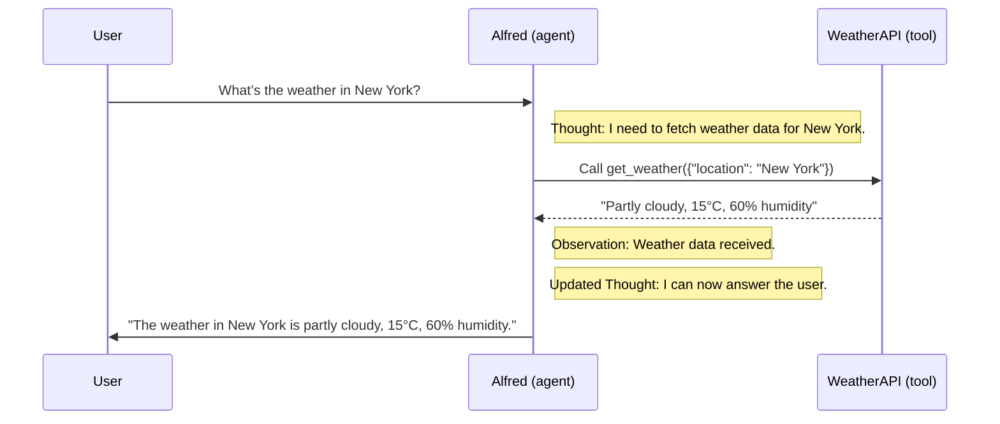
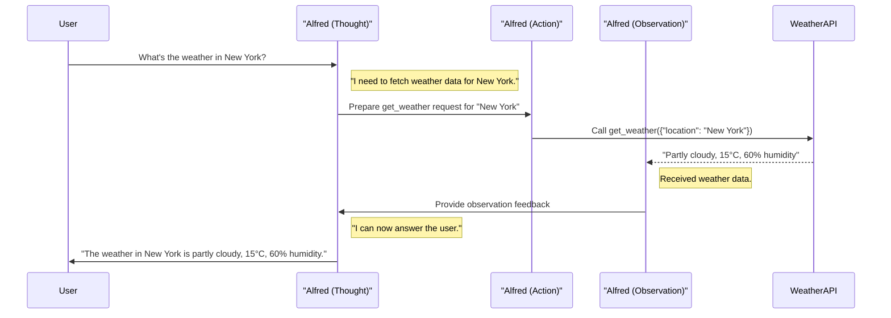

***REVIEW THE MERMAID FLOW - PROCESS***

```mermaid
sequenceDiagram
    participant User
    participant Alfred (agent)
    participant WeatherAPI (tool)

    User ->> Alfred (agent): What’s the weather in New York?

    Note right of Alfred (agent): Thought: I need to fetch weather data for New York.

    Alfred (agent) ->> WeatherAPI (tool): Call get_weather({"location": "New York"})

    WeatherAPI (tool) -->> Alfred (agent): "Partly cloudy, 15°C, 60% humidity"

    Note right of Alfred (agent): Observation: Weather data received.

    Note right of Alfred (agent): Updated Thought: I can now answer the user.

    Alfred (agent) ->> User: "The weather in New York is partly cloudy, 15°C, 60% humidity."
```

```mermaid
sequenceDiagram
    participant User
    participant Alfred (agent)
    participant WeatherAPI (tool)

    User ->> Alfred (agent): What’s the weather in New York?

    Note right of Alfred (agent): Thought: I need to fetch weather data for New York.

    Alfred (agent) ->> WeatherAPI (tool): Call get_weather({"location": "New York"})

    WeatherAPI (tool) -->> Alfred (agent): "Partly cloudy, 15°C, 60% humidity"

    Note right of Alfred (agent): Observation: Weather data received.

    Note right of Alfred (agent): Updated Thought: I can now answer the user.

    Alfred (agent) ->> User: "The weather in New York is partly cloudy, 15°C, 60% humidity."
```

```mermaid
sequenceDiagram
    participant User
    participant Alfred_Thought as "Alfred (Thought)"
    participant Alfred_Action as "Alfred (Action)"
    participant Alfred_Observation as "Alfred (Observation)"
    participant WeatherAPI

    User ->> Alfred_Thought: What's the weather in New York?
    Note right of Alfred_Thought: "I need to fetch weather data for New York."

    Alfred_Thought ->> Alfred_Action: Prepare get_weather request for "New York"

    Alfred_Action ->> WeatherAPI: Call get_weather({"location": "New York"})
    WeatherAPI -->> Alfred_Observation: "Partly cloudy, 15°C, 60% humidity"

    Note right of Alfred_Observation: Received weather data.

    Alfred_Observation ->> Alfred_Thought: Provide observation feedback

    Note right of Alfred_Thought: "I can now answer the user."

    Alfred_Thought ->> User: "The weather in New York is partly cloudy, 15°C, 60% humidity."
```